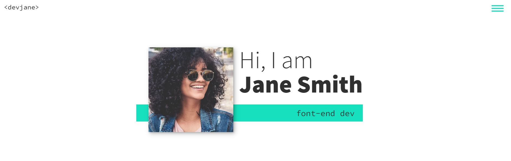
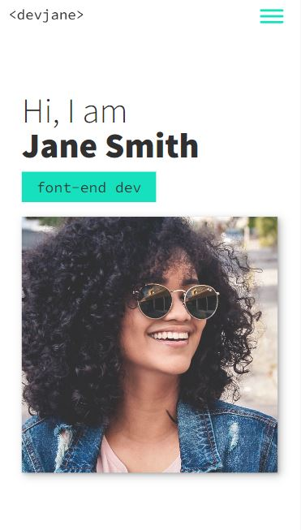
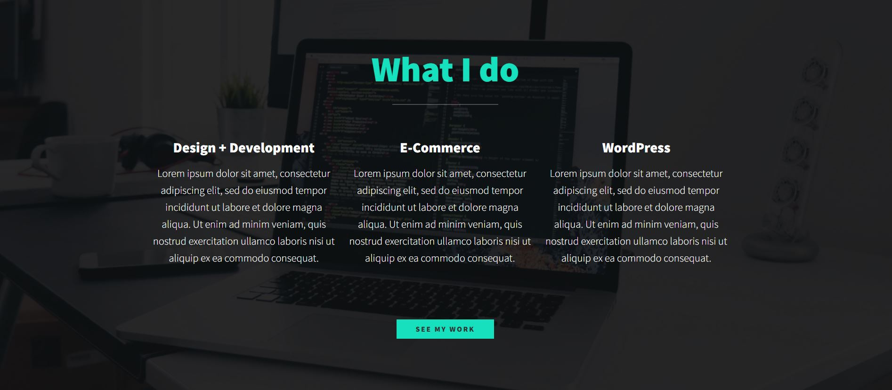
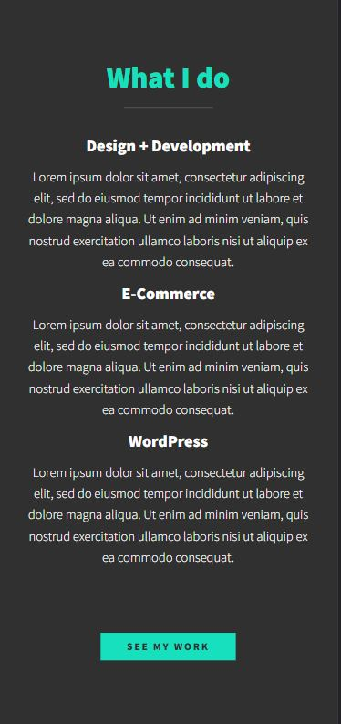
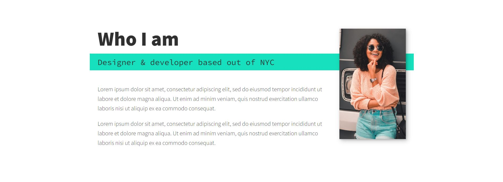
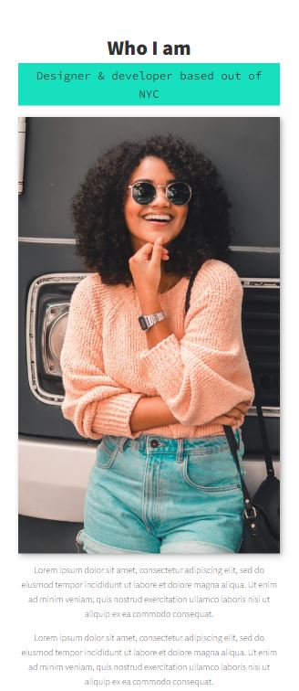
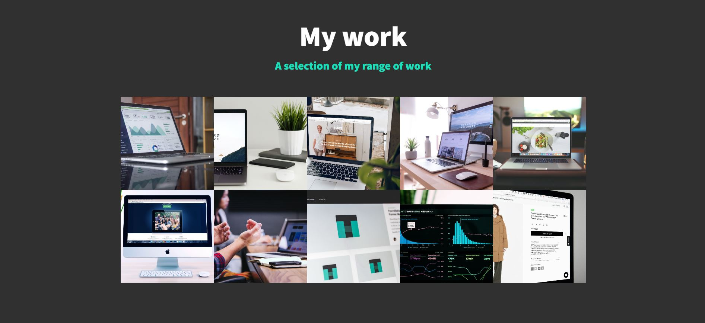
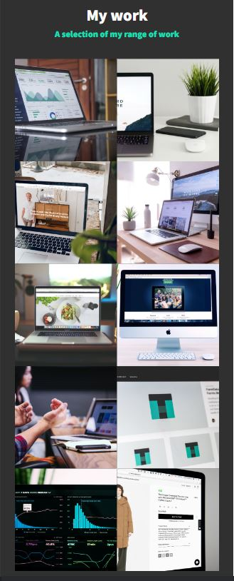

## Table of contents

- [Overview](#overview)
  - [Screenshot](#screenshot)
  - [Links](#links)
- [My process](#my-process)
  - [Built with](#built-with)
- [Author](#author)

## Overview

### Screenshot

#### Home Desktop
  

### Home Mobile  
  

#### My services Desktop
  

### My services Mobile
  

### About me Desktop
  

### About me Mobile
  

#### My work Desktop  
  

### My work Mobile  
  
  
### Links  

- Solution URL: [click here](https://github.com/kunal-arya/Portfolio-Template-website)
- Live Site URL: [click here](https://portfolio-template-website-k.netlify.app/)

## My Process  

### Built with  

- Semantic HTML5 markup
- CSS custom properties
- Flexbox
- CSS Grid
- Mobile-first workflow
- vanilla javascript

## Author

- Twitter - [@KunalAryaa](https://twitter.com/KunalAryaa)
